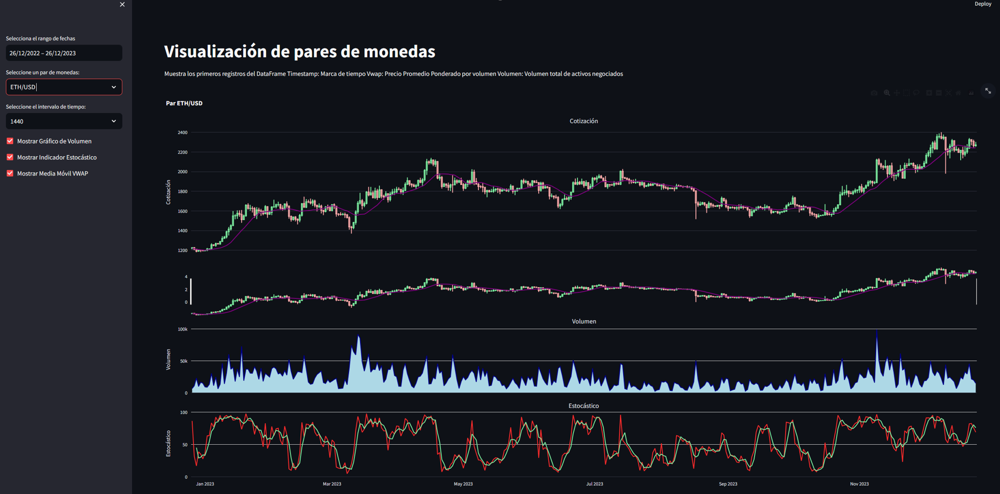

# Data Scientist

Driven by a passion for data and technology, and equipped with an analytical and business-focused mindset, I thrive on new challenges that enhance my skills and encourage ongoing personal and professional development. My ambition is to make a meaningful contribution to the data department of a forward-thinking organization. I aim to collaborate on innovative projects and absorb knowledge from industry professionals, which will inspire me to continuously improve and expand my expertise.

### Technical Skills
#### General skills: 
Python, SQL, MongoDB, GIT, Excel, VBA
#### Cloud: 
Azure, AWS
#### Machine learning & IA: 
sci-kit learn, TensorFlow
#### Data visualization: 
Tableau, Power BI, Streamlit

## Education			       		
- M.S., Data Science	| universidad de Navarra (_July 2024_)	 			        		
- B.S., Management Engineering | Universidad de Valladolid (_Jun 2022_)

## Languages:
- Spanish: Native
- English: C1

## Work Experience
**Renault | Aluminum Casting - Renault Graduate (_January 2023 - July 2023_)**
- Analysis and Resolution of Non-Value Added Causes
- SMED Project - Die Change (Time Reduction)
- Data collection involving die changes
- Shift Management in the die Workshop
- LEAN Methodologies: 5S, Kanban, TPM...

**Renault | Bodywork Engineering - Scholarship (_December 2020 - Present_)**
- Development of technical documentation for Manufacturing
- Collaboration in the Process Engineering Department

## Projects

### Data Science Jobs Salaries Prediction
[GitHub Project](https://github.com/ACarracedoOrtiz/Data-Scientist-Jobs-predictions)

### Bank Products Recommender System
[GitHub Project](https://github.com/ACarracedoOrtiz/Bank-product-recommender-system)
![image]

### Airline Customer Satisfaction
[GitHub Project](https://github.com/ACarracedoOrtiz/Airline-Customers-satisfaction)

### AIRBNB Berlin Housing Analysis
[View on Tableau Public](https://public.tableau.com/shared/9SGW8MMK7?:display_count=n&:origin=viz_share_link)

### OHLC and Indicators with Streamlit
[GitHub Project](https://github.com/ACarracedoOrtiz/OHLC-and-Indicatords-representation)

